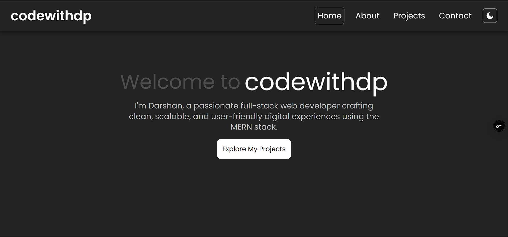
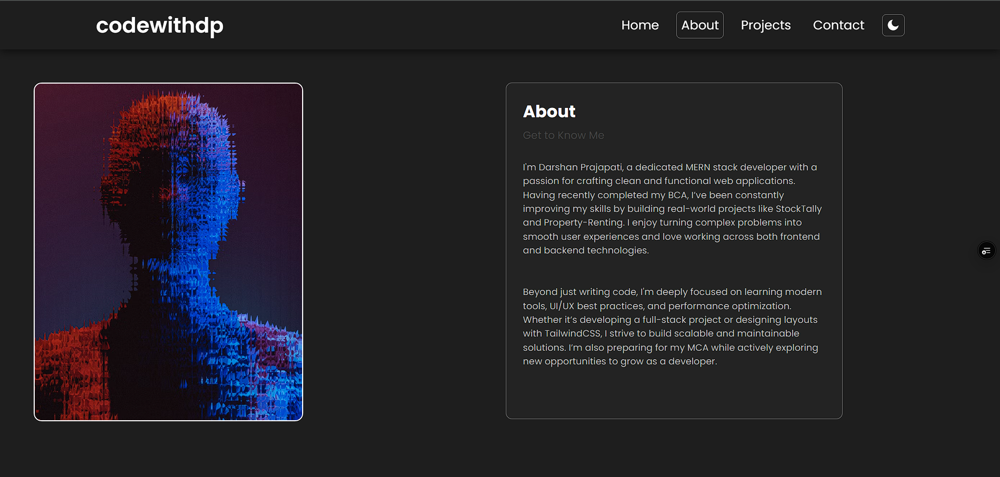
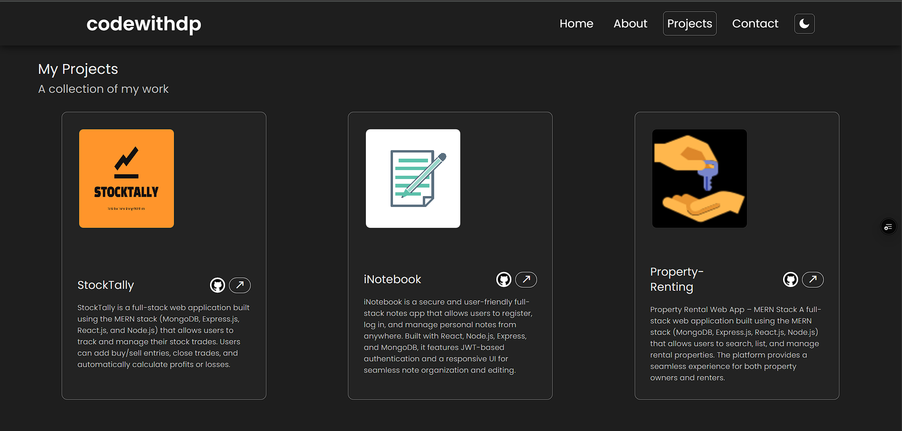
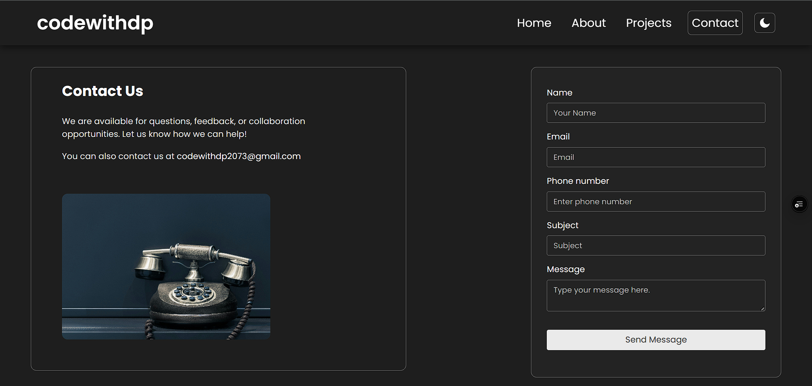

# 💼 Codewithdp — Personal Portfolio

Welcome to the source code of my personal portfolio website — **Codewithdp** (Darshan Prajapati).  
This project showcases my work, skills, and contact information in a clean and responsive design.

---

## 🚀 Tech Stack

- **Frontend:** React + Vite
- **Styling:** Tailwind CSS
- **Animations:** [React Bits](https://reactbits.dev/) + [Lenis](https://github.com/studio-freight/lenis) for smooth scrolling
- **Deployment:** Vercel
- **Icons:** Remix Icons

---

## 🎞️ Features

- ✅ Fully responsive and mobile-friendly layout
- ✅ Smooth scrolling using **Lenis**
- ✅ Scroll-based animations with **React Bits**
- ✅ Project showcase with live demo links
- ✅ SEO-ready metadata and Open Graph preview
- ✅ Clean and modern Tailwind-based UI

---

## 🖼 Preview

### Screenshots 

#### Home



#### About



#### Projects



#### Contact



---

## 🔗 Live Site

👉 [Visit Live Portfolio](https://codewithdp.vercel.app)

---

## 📁 Folder Structure

```
public/
├── assets/         # Images, icons, logos
src/
├── components/     # Navbar, Footer, Cards, etc.
├── context/        # Theme Context
├── pages/          # Home, Projects, Contact
├── styles/         # Custom css
├── App.jsx         # Main app
├── main.jsx        # Entry point
```

---

## 🛠️ How to Run Locally

```bash
git clone https://github.com/codewithdp20703/codewithdp.git
cd codewithdp
npm install
npm run dev
```

Open `http://localhost:5173` in your browser.

---

## ✨ Integrations

### 🎯 Lenis (Smooth Scrolling)

Used for buttery smooth scroll effects:

```bash
npm install @studio-freight/lenis
```

### 🎯 React Bits (Animations)

Used for simple scroll-based animations:

```bash
npm install @reactbits/animation
```

---

## 📬 Contact

- ✉️ Email: codewithdp@gmail.com
- 🔗 GitHub: [@codewithdp20703](https://github.com/codewithdp20703)
- 💼 LinkedIn: [linkedin.com/in/darshan-prajapati-523202282](https://linkedin.com/in/darshan-prajapati-523202282)

---

> Built with ❤️ by **Darshan Prajapati** — Full-Stack Developer & BCA Graduate
